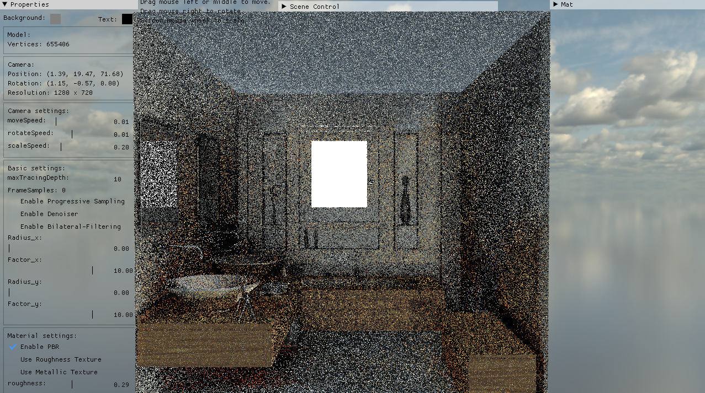
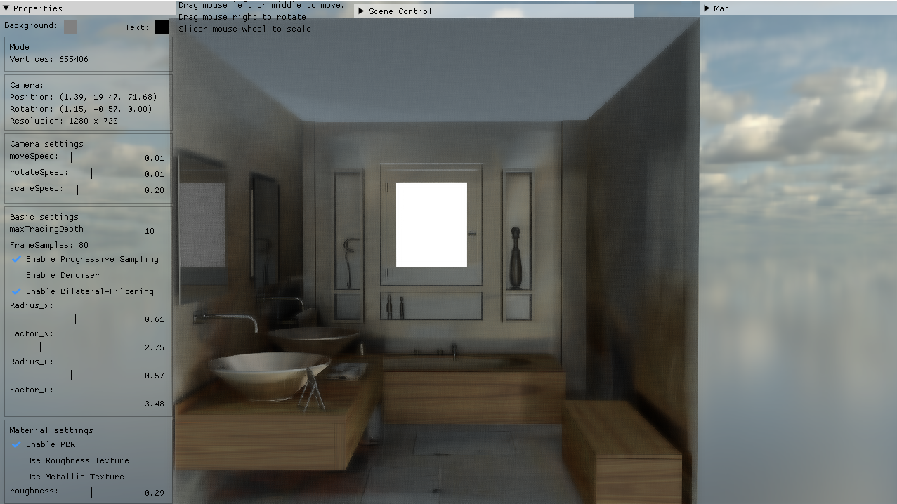
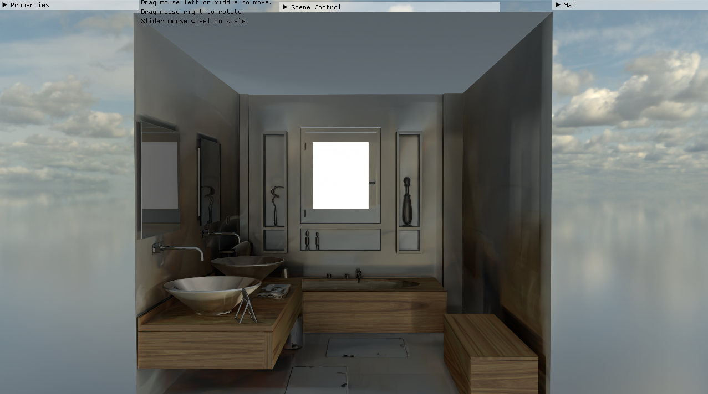
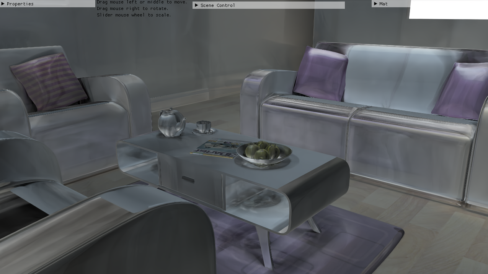
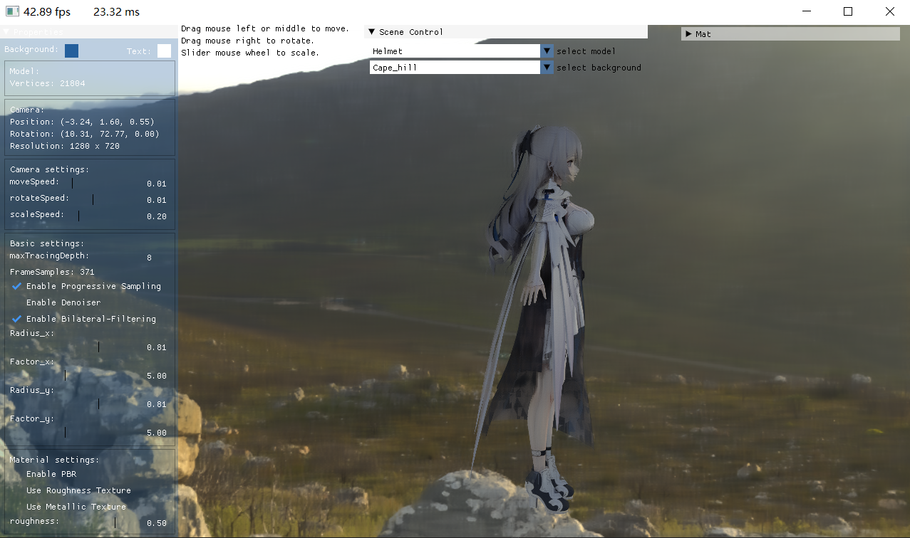
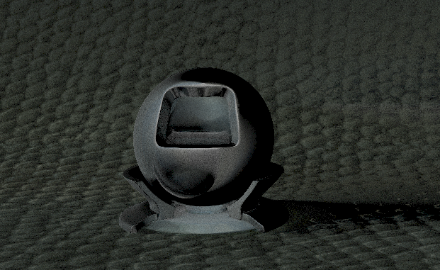

# Realtime Raytracing Renderer

## About

A realtime pathtracing renderer based on OptiX7. [Cilck here For detail.](./brief.pdf)

## Installation

### Prerequisites

You will need the following environment.

- OptiX 7.x SDK
- OptiX7 supported hardware and display driver
  - A NVIDIA GPU with raytracing support. (such as NVIDIA GeForce GTX/RTX series)
  - Newest  NVIDIA Display Driver
- CUDA Toolkit 11.0 or above
- platform
  - Windows 10 or 11
- build tools
  - CMAKE 3.10 or above
  - VS 2019 (Windows SDK needed)
- C++ 17 or above
- OpenGL 3.0 or above

### Build

``` bash 
git clone git@github.com:hjb546827/Real-time-Raytracing-Renderer.git
cd Real-time-Raytracing-Renderer
cmake . -Bbuild -G "Visual Studio 16 2019"
cmake --build build
```

If failed, use cmake-gui to manually specify the path that warnings mentioned. 

### Run

```bash
cd build
.\PathTracer.exe
```

## Usage

- Translate camera: the middle mouse button
- Rotate camera: the right mouse button
- Zoom in/out: the mouse wheel
- Change model: double-click the 'Scene Control' button and select model.
- Change environment: the same as changing model.
- Customize
  - Double-click the 'Properties' button and you can change GUI colors, camera properties, post-process settings, material settings, etc.
  - Double-click the 'Mat' button and you can configure the model's material parameters in detail.

## Features

- [x] Realtime interactive viewport
- [x] Pathtracing
  - [x] Monte-Carlo Pathtracing
  - [x] Importance Sampling
  - [x] Russian-Roullete
  - [x] Image Based Lighting
  - [x] Mixture Sampling(cos, average)
  - [ ] Multi-Importance Sampling
- [x] Shading
  - [x] Phong Model
  - [x] Disney PBR Model
    - [x] BRDF
    - [ ] BTDF
    - [x] BSSRDF
- [x] GUI
  - [x] ImGUI
- [x] Post-processing
  - [x] Progressive Sampling
  - [ ] Gauss Blur
  - [x] Bilateral-Filtering
  - [x] AI Denoising
- [x] Textures
  - [x] 8 environment-texture prefabs
  - [x] PBR texture support for each object
  - [x] Realtime texture-changing
- [x] Models
  - [x] 9 prefabs
  - [ ] Muti-models support
  - [x] Realtime model-changing
- [x] Math Library
  - [x] GLM
  - [ ] Custom Math Library

## Performance

|         No post-process         | With Progressive Sampling and filtering          | With OptiX AI Denoising                     |
| :-----------------------------: | ------------------------------------------------ | ------------------------------------------- |
|  |  |  |

**Platform**

- Windows 10
- Intel Core i7-11800H @ 2.3GHz (Laptop)
- Nvidia RTX 3060 6GB VRAM (Laptop)
- 16GB RAM @ 3200 MHz

**Rendering Results**





**Platform**

- Windows 10
- Intel Core i7-10750H @ 2.6GHz (Laptop)
- Nvidia GTX 1650Ti 4GB VRAM (Laptop)
- 16GB RAM @ 3200 MHz

**Rendering Results**




